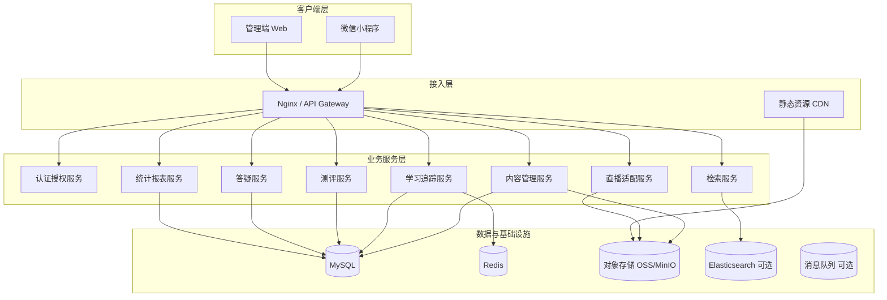
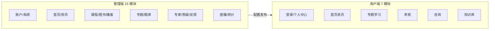
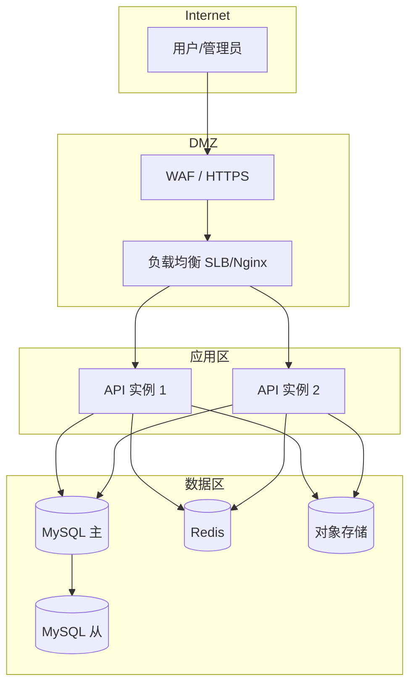
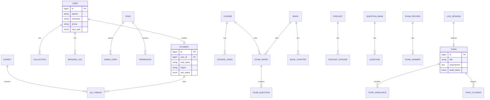

# Design — 江苏中医在线平台（高保真技术设计）

## 1. 设计概述

本文档在 `spec.md` 需求基础上，给出**可落地的技术架构、领域模型、接口分层、部署与安全**设计，供研发与 UI 实现对齐。

---

## 2. 总体架构

### 2.1 逻辑架构（四层）



### 2.2 功能架构（与手册对齐）



### 2.3 部署架构



**推荐规格（对齐原手册并适度升级）**

| 组件 | 原手册 | 推荐 |
|---|---|---|
| 应用服务器 | 4C8G ×1 | 4C8G ×2（可水平扩展） |
| OS | CentOS 7.3+ | Rocky Linux 8 / Ubuntu 22.04 LTS |
| DB | MySQL 5.0+ | MySQL 8.0 主从 |
| 反向代理 | Nginx 1.14 | Nginx 1.24+ / OpenResty |
| 缓存 | — | Redis 7 |
| 文件 | — | OSS 或 MinIO |

---

## 3. 技术选型

### 3.1 推荐栈（新建/重构）

| 层级 | 技术 | 说明 |
|---|---|---|
| 管理端 | Vue 3 + TypeScript + Element Plus | 对应 15 个后台模块 |
| 小程序 | uni-app（编译为微信小程序） | 微信授权、分享 |
| API | Spring Boot 3 + Java 17 | RESTful，OpenAPI 3 |
| ORM | MyBatis-Plus | 复杂统计 SQL 可控 |
| 鉴权 | JWT + RBAC；小程序 wx.login + session | 管理端账号密码 |
| 任务 | XXL-Job / Spring Scheduler | 统计聚合、切片任务 |
| 搜索 | Elasticsearch 8（可选） | 资讯/知识库全文检索 |
| 文档 | 富文本 TinyMCE / WangEditor | 资讯编辑 |
| 媒体 | 阿里云 OSS / 腾讯云 COS | 视频、音频、PDF、EPUB |
| 直播 | 腾讯云直播 / 保利威 等 | 抽象 LiveProvider |

### 3.2 与旧系统对齐说明

原手册仅声明 Linux + MySQL + Nginx + Chrome，未指定后端语言。若需**迁移而非重写**，可保留原 API 契约，管理端逐步 Vue 化；本文档按**现代化重构**给出默认方案。

---

## 4. 领域模型（核心实体）

### 4.1 ER 关系概览



### 4.2 关键表清单

| 域 | 表名 | 用途 |
|---|---|---|
| 账户 | `sys_admin`, `sys_role`, `sys_permission`, `sys_role_permission` | RBAC |
| 账户 | `app_user`, `student`, `student_import_batch` | 用户与学员 |
| 内容 | `article`, `article_category`, `home_banner`, `home_category` | 资讯与首页 |
| 内容 | `course`, `course_video`, `book`, `book_category`, `book_chapter` | 学习资源 |
| 内容 | `podcast`, `podcast_episode`, `live_session` | 音频与直播 |
| 专题 | `topic`, `topic_resource`, `topic_student` | 专题聚合 |
| 测评 | `question_bank`, `question`, `exam_paper`, `exam_record` | 题库与考试 |
| 学习 | `learning_progress`, `learning_duration`, `credit_log` | 学时/进度 |
| 专家 | `expert`, `expert_category`, `qa_thread`, `qa_reply` | 答疑 |
| 知识库 | `kb_book`, `kb_chapter`, `kb_bookmark` | 知识库 |
| 运营 | `feedback`, `audit_log`, `statistics_snapshot` | 反馈与统计 |

### 4.3 审核状态机（通用）

```
DRAFT → PENDING → APPROVED → PUBLISHED
              ↘ REJECTED ↗
```

适用：课程、图书、资讯、播客、直播、专题。

---

## 5. API 设计规范

### 5.1 路由前缀

| 前缀 | 消费者 | 鉴权 |
|---|---|---|
| `/api/admin/v1/*` | 管理端 | JWT + RBAC |
| `/api/app/v1/*` | 小程序 | 微信 session / token |
| `/api/common/v1/*` | 公共 | 上传等 |
| `/api/web/v1/*` | 官网 | 公开读；限流；无 JWT |
| `/api/open/v1/*` | 健康通等 | 二期 AppKey 签名 |

> 官网一期**不提供**学习播放、考试提交、登录态；详见 `16-official-web/design.md`。

### 5.2 核心 API 示例

**认证**

```
POST /api/admin/v1/auth/login          # 管理端登录
POST /api/app/v1/auth/wx-login         # code 换 session
POST /api/app/v1/student/certify       # 学员认证
```

**首页与资讯**

```
GET  /api/app/v1/home                  # 首页聚合
GET  /api/app/v1/articles              # 资讯列表 ?category&keyword
GET  /api/app/v1/articles/{id}         # 详情
POST /api/app/v1/articles/{id}/collect # 收藏
```

**专题与学习**

```
GET  /api/app/v1/topics/{id}           # 专题详情 + 资源树
GET  /api/app/v1/courses/{id}/videos
POST /api/app/v1/learning/progress     # 上报进度/时长
```

**考核**

```
GET  /api/app/v1/exams?topicId=
POST /api/app/v1/exams/{paperId}/submit
GET  /api/app/v1/exams/records/{id}    # 成绩结果
```

**管理端 — 学员**

```
GET  /api/admin/v1/students
POST /api/admin/v1/students
PUT  /api/admin/v1/students/{id}
POST /api/admin/v1/students/import
GET  /api/admin/v1/students/export
```

**统计**

```
GET /api/admin/v1/stats/learning-hours?from&to&region
GET /api/admin/v1/stats/students
GET /api/admin/v1/stats/scores
```

### 5.3 统一响应

```json
{
  "code": 0,
  "message": "ok",
  "data": {},
  "traceId": "..."
}
```

分页：`{ list, total, page, pageSize }`

---

## 6. 权限模型（RBAC）

### 6.1 预置角色

| 角色 | 权限范围 |
|---|---|
| super_admin | 全部模块 |
| content_editor | 内容 CRUD（无审核通过） |
| auditor | 审核通过/驳回 |
| student_admin | 学员/用户/导入导出 |
| analyst | 只读统计 |
| expert | 答疑回复（限定本人） |

### 6.2 权限码示例

```
course:view | course:create | course:audit | course:publish
book:*  article:*  topic:*  exam:*  stats:export
```

管理端登录后：`GET /api/admin/v1/menus` 按权限过滤左侧菜单（对应手册「根据用户权限展示不同模块」）。

---

## 7. 关键子系统设计

### 7.1 学习追踪

- 视频/音频：心跳上报（每 30s）+ 完成阈值（≥90% 时长）
- 图书：章节阅读进度 + 书签
- 聚合：`learning_duration` 按日汇总至 `statistics_snapshot`

### 7.2 测评引擎

| 题型 | 判分规则 |
|---|---|
| 单选 | 完全匹配 |
| 多选 | 选项集合完全匹配 |
| 填空 | 标准化后匹配（去空格、同义词表可选） |

组卷策略：固定卷 / 按题库随机 N 题（项目介绍要求）。

### 7.3 知识库切片

```
上传书籍(PDF/EPUB) → 异步解析章节 → kb_chapter 树 → 小程序目录渲染
→ 可选绑定 question_bank 章节练习
```

### 7.4 直播适配

```java
interface LiveProvider {
  CreateResult createRoom(LiveConfig config);
  String getPlayUrl(String roomId);
  void handleCallback(LiveEvent event);
}
```

管理端「直播配置」映射：`title`, `startTime`, `cover`, `topicId`, `thirdPartyRoomId`, `auditStatus`.

### 7.5 搜索

- 一期：MySQL `FULLTEXT` + 分类筛选
- 增强：ES 索引 `article`, `kb_chapter`, `book`

---

## 8. 安全设计

| 项 | 措施 |
|---|---|
| 传输 | 全站 HTTPS，HSTS |
| 认证 | 管理端密码 bcrypt；失败锁定；小程序 session 过期 |
| 授权 | 接口级 `@PreAuthorize` + 数据域（专家只看自己的答疑） |
| 审计 | `audit_log` 记录审核、删除、导出 |
| 文件 | OSS 私有桶 + 签名 URL；类型与大小白名单 |
| 接口 | 限流、防重放（关键写操作 idempotency-key） |
| 隐私 | 手机号脱敏展示；导出加水印/权限 |

---

## 9. 与手册模块映射

| 管理端模块 | 后端服务 | 主要实体 |
|---|---|---|
| 用户/学员管理 | AUTH + CMS | app_user, student |
| 系统管理 | AUTH | sys_* |
| 首页/资讯 | CMS + SEARCH | home_*, article |
| 课程/图书/播客 | CMS + LEARN | course, book, podcast |
| 专题/题库 | CMS + EXAM | topic, question |
| 专家/答疑/反馈 | QA | expert, qa_thread, feedback |
| 直播 | LIVE + CMS | live_session |
| 统计 | STAT | statistics_snapshot |

| 用户端模块 | API 域 |
|---|---|
| 登录/个人中心 | AUTH |
| 首页资讯 | CMS, SEARCH |
| 专题学习 | CMS, LEARN |
| 考核 | EXAM |
| 咨询 | QA |
| 知识库 | CMS, SEARCH |

---

## 10. 二期扩展预留

| 能力 | 设计预留 |
|---|---|
| 无纸化考核 | 独立 `exam-system` 服务 + 统一用户 SSO |
| 投票/问卷 | `campaign`, `campaign_vote`, `campaign_survey` |
| 健康通 | `/api/open/v1` + 内容联邦缓存 |
| 可视化大屏 | 只读 API + WebSocket 推送统计 |
| 版本控制 | 小程序 `minVersion` 配置 + 强制更新策略 |

---

## 11. 文档关联

- 需求范围：`spec.md`
- 界面高保真：`ui-prototypes.md`
- 任务拆解：`tasks.md`
